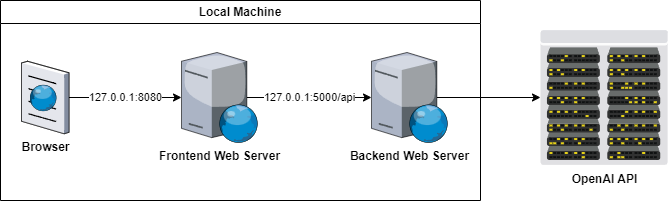

# AirAI Test

## Project Setup and Execution

<p align="center">
  
</p>

### Backend Web Server

#### 1. Requirements

- **Python 3**

#### 2. Setup steps

- Install Python dependencies:

``` bash
pip install langchain
pip install openai
```

#### 3. Execution steps

- Set up the OpenAI API key:

(Linux)

``` bash
export OPENAI_API_KEY="<API_KEY>"
```

(Windows)

``` bash
set OPENAI_API_KEY="<API_KEY>"
```

- Change the current directory to `air-ai-backend`

``` bash
cd air-ai-backend
```

- Start the Web server

``` bash
python server.py
```

### Frontend Web Server

#### 1. Requirements

- **Node 16+**

#### 2. Setup steps

- Change the current directory to `air-ai-frontend`

``` bash
cd air-ai-frontend
```

- Install package dependencies:

``` bash
npm install
```

#### 3. Execution steps

- Change the current directory to `air-ai-frontend`

``` bash
cd air-ai-frontend
```

- Start the Web server

``` bash
npm run dev
```

## Approach

The frontend solution is pretty straight forward: get a JSON object from the backend server with cities as keys and their respective air quality index as values and render a speedometer for each city.

The backend solution consists of using the AI to evaluate the user query, extract the list of cities mentioned in the response and finally getting the air quality index for each city.

## Challenges

A user query can contain:

- a city that the user is interested in knowing its air quality

> What is the air quality in Paris?

- a city that the user is not interested in knowing its air quality

> What are the cities with the best air quality near Paris?

- no city names

> What are the cities with the worst air quality?

So trying to extract the city names directly from the user query is not going to work.

## Areas of Improvement

- Use the browser Geolocation API for queries like:

> What’s the current air quality? (where I am)

- Use a dedicated API for air quality index data as OpenAI API is not consistent for some cities and has no data for others.
